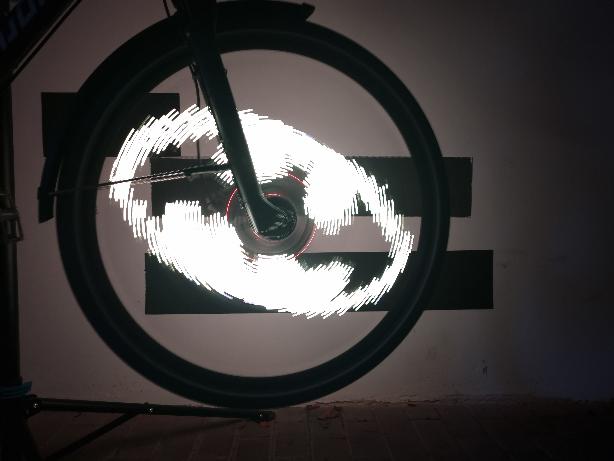
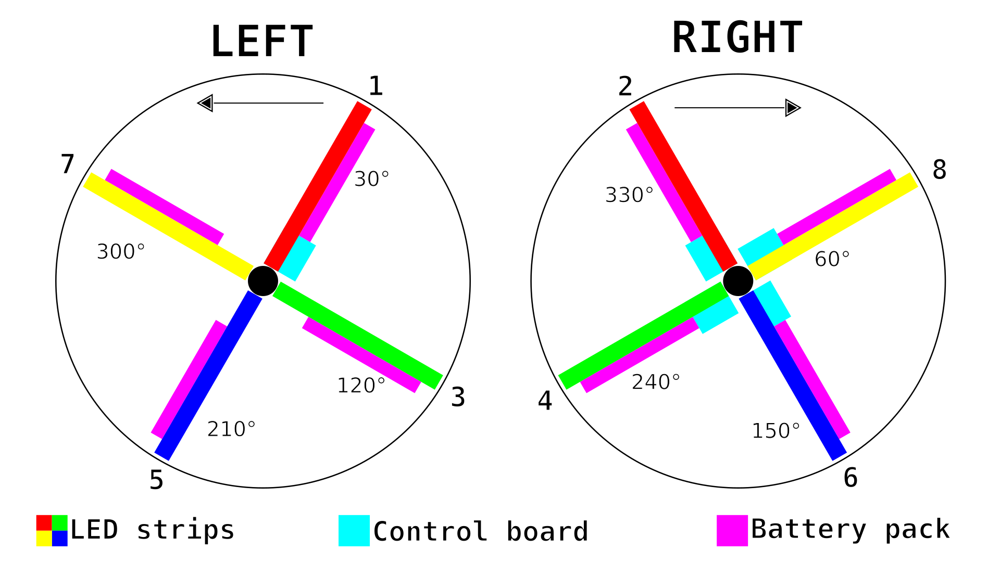

# BikeBeamer

## Overview

> This is a **work in progress**. Things aren't final and are due to change over time.

This is my next generation of bike POV displays based on [bkpvdsply](https://github.com/locxter/bkpvdsply). With much extended functionality, a more polished design and an easier user-experience, the goal for it is to extend my capabilities and experiment with building a "real product" that lives up to the expectations one might have.

## Dependencies

I generally try to minimize dependencies, but I'm a one man crew and can therefore only support Debian-based Linux distributions as I'm running one myself. Anyway, you need to have the following packages installed for everything to work properly:

- Arduino IDE as a way to compile the Arduino code. Install it with `sudo apt install arduino`.
- Arduino ESP32 LittleFS uploader for uploading the data. Install it via the [installation guide](https://github.com/lorol/arduino-esp32fs-plugin).
- Adafruit NeoPixel library for controlling the LEDs. Install it via the integrated library manager.
- MPU6050_tockn library for communicating with the gyroscope. Install it via the integrated library manager.

## Improvements over bkpvdsply

### Hardware

- [x] Reduce the overall height to fit slimmer wheels
- [x] Rethink the mounting system to be easier for the user
- [x] FAILED: ~~Switch to a reusable cable tie alternative~~
- [ ] Improve the water resistance (ideally water proof)
- [x] Make everything more balanced (equal weight distribution)
- [x] Add LED strips to both sides

### Electronics

- [x] Improve battery runtime
- [x] ABANDONED VIA SWITCH TO BATTERIES: ~~Make charging easier~~
- [x] Develop a properly sized power supply unit
- [x] Use custom-made circuit boards
- [ ] Switch to all SMT components
- [ ] Off-hand to production to a specialized vendor

### Software

- [x] Implement customizable LED strip positions (relative to control board)
- [x] Allow the rotation direction to be reversed (when the control board back faces right)
- [x] Use LED trips on both sides to display the image
- [x] Allow the image to be mirrored for the second side (useful for symbols and graphics, but not text)
- [ ] Reduce storage size of images (ideally via file compression)
- [ ] Add the ability to make animations with more than 2 images
- [x] Improve image stability (more exact rotation and speed change detection, smooth measuremets)
- [x] Implement customizable sampling threshold (allowed variation to trigger rotation detection)

And more to come...

## How to build it

In order to create a device able to produce such wonderful visuals, you only need rather common components (an ESP32, some LED strips, an IMU and ome sort of power supply), but their combination results in this really special outcome. Everything is based on a custom PCB onto which all of the other components are soldered. Here's what the finished outcome should look like:

Even though many sequences of assembly will result in functional boards, here's how I assemble them after trying out several approaches with varying success:

1. In case you went for the cheap battery holders from Amazon, cut off the brim on the bottom, sand this side for better adhesive contact, shorten the wires and tin them in advance.
2. As always, parts should be soldered in the order of their height. So start off cutting the LED strips to their desired length of 32 LEDs and solder them with the arrows facing towards the slim end of the boards from each side. It's easiest to solder one side of a strip, apply some instant glue along it's way and then solder the other one mounting it into place.
3. After that's done, continue with the diodes - be careful to install them the right way around (silver ring facing the marked direction) - and On/Off switch.
4. Now it's time install the ESP32 and IMU. Solder male headers facing down to the D1 Mini board in case not already done and then mount their female counterparts to the main PCB. You can also fill the contacts on the the other boards, but that's not necessary. Then add the right-angle connector to the MPU-6050 board so that it can be mounted vertically to the PCB with its back facing to the wide end of the board and solder it down.
5. You're getting there, just add the screw terminals and then capacitors with the polarity of the latter being crucial (white component markings should face the filled side on the PCB).
6. If necessary glue down the battery holders and then solder them into place - this can be quite tight, but should be doable.
7. To prevent shorts with the spokes from happing isolate the back side with some duck tape or equivalent material. If you want everything to be more moisture resistant, you can also look into spray rubber products.
8. Finally, install the connection cables in the consistent matter and make sure that there are no shorts or other critical mistakes.

Below is a full bill of materials with German sources for all required parts:

| Quantity (not necessarly the order quantity): | Item: | Source: |
| --- | --- | --- |
| 1 | ESP32 D1 Mini | [Amazon](https://www.amazon.de/dp/B08BTLYSTM) |
| 1 | MPU-6050 | [Amazon](https://www.amazon.de/AZDelivery-MPU-6050-3-Achsen-Gyroskop-Beschleunigungssensor-Arduino/dp/B07TKLYBD6) |
| 2 | LED strip (144 LEDs/m) | [Amazon](https://www.amazon.de/dp/B08JJ6S1HC) |
| 12 | Battery holder | [RS Components](https://de.rs-online.com/web/p/batteriehalter/6119576) OR [Amazon](https://www.amazon.de/AA-Batteriehalter-KUOQIY-Batteriehalter-Drahtkabeln-Schraubendreher/dp/B0C2Q6JV88) |
| 4 | Power switch | [RS Components](https://de.rs-online.com/web/p/schiebeschalter/7347334) OR [Amazon](https://www.amazon.de/RUNCCI-YUN-Schiebeschalter-Positionen-Vertikal-Schalter/dp/B09TVDZ8P2) |
| 4 | Reverse-voltage diode (1N5820) | [RS Components](https://de.rs-online.com/web/p/schottky-dioden-und-gleichrichter/6547224) OR [Amazon](https://www.amazon.de/ALLECIN-1N5820-Schottky-Gleichrichterdiode-Siliziumdioden/dp/B0CKSH71TP) |
| 12 | Power smoothing capacitor (1000μF) | [RS Components](https://de.rs-online.com/web/p/aluminium-elektrolytkondensatoren/1815420) OR [Amazon](https://www.amazon.de/Kondensator-radial-1000%C2%B5F-RJF-10V102MH4-1000uF/dp/B07H9BFK31) |
| 6 | Screw terminal | [RS Components](https://de.rs-online.com/web/p/leiterplatten-printklemmen/1731613) OR [Amazon](https://www.amazon.de/RUNCCI-St%C3%BCcke-Terminal-Schraubklemme-Steckverbinder/dp/B07RR7D267) |
| 6 | JST SM 3 pin cable | [Amazon](https://www.amazon.de/YIXISI-M%C3%A4nnlichen-Weiblichen-Steckverbinder-Elektrisch/dp/B08JV8TJ9N) |
| 15 | Cable ties | [Amazon](https://www.amazon.de/Kabelbinder-Rscolila-Hochleistungs-Kabelmanagement-300mmx5mm/dp/B08ZC7PBSD) |
| 12 | AA battery | [Amazon](https://www.amazon.de/Varta-Industrial-Batterie-Alkaline-Batterien-blau/dp/B00LN803LE) |
| 1 | Duck tape | [Amazon](https://www.amazon.de/3M-Gewebeklebeband-1900-Schwarz-1-er/dp/B006MKBVNM) |
| 3 | Instant glue [Amazon](https://www.amazon.de/UHU-Sekundenkleber-blitzschnell-original-versiegelte/dp/B06WVTZYWF) |

## How to use it

1. Build the hardware as described above and put the batteries in.
2. Select the "WEMOS D1 MINI ESP32" board in the Arduino IDE.
3. Flash the sketch with the following settings:
    - `Upload Speed: 9215600`
    - `CPU Frequency: 240MHz (WiFi/BT)`
    - `Flash Frequency: 80MHz`
    - `Partition Scheme: No OTA (Large APP)`
    - `Core Debug Level: None`
    - `Erase All Flash Before Sketch Upload: Disabled`
4. Upload the additional files via the Arduino ESP32 LittleFS uploader.
5. After turning on BikeBeamer, give the ESP roughly half a minute to boot up.
6. Connect to the Wi-Fi network `BikeBeamer`, open any webpage (or `192.168.0.1` if the local DNS server doesn't work) and upload an image (examples are in the `images` folder).
7. Test the assembled hardware on your workbench and check if everything works as expected. Here is some reference footage:

    [Loose boards in action](loose-in-action.mp4)

    

8. Mount it on your bike with some cable ties like this:

    

    

    

7. Then just hop on your bike and enjoy the glory of this next generation POV display. Here's just some inspiration:

    [Mounted boards in action](mounted-in-action.mp4)
    

## Developer notes

- All angles used are in counted in degrees clockwise from 12 o'clock looking at the left side of the bike
- All coordinate systems used have their origin at the bottom left
- The PCBs are mounted with the back side visible when looking at the left side of the bike and connected in clockwise direction
- All indexes in the code are zero-based, while all user interfaces and visualisations use regular, one-based numbering

### Mounting visualisation

### Image display visualisation

## Similiar projects

- https://subethasoftware.com/bikelights/
- https://www.kickstarter.com/projects/minimonkey/monkey-light-pro-bicycle-wheel-display-system/description
- https://learn.adafruit.com/spokepov/overview
- https://www.ladyada.net/make/spokepov/
- https://learn.adafruit.com/bike-wheel-pov-display/overview
- https://bicycletouringpro.com/hokey-spokes-bicycle-lights-review/